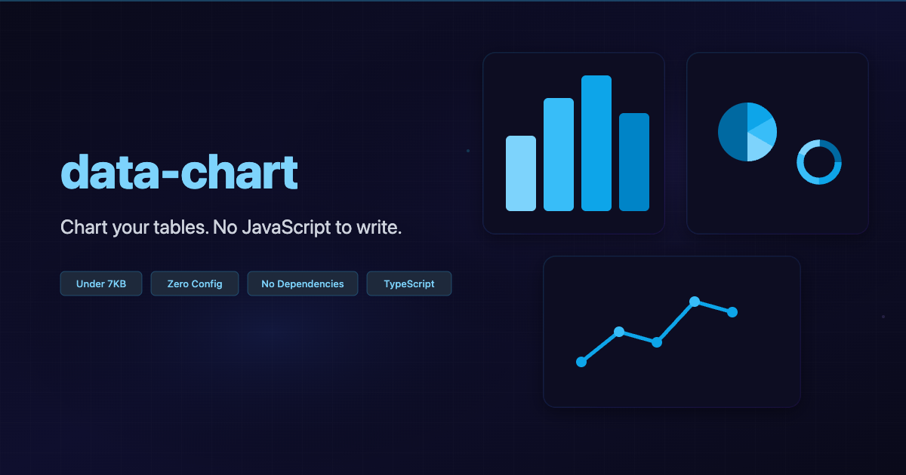

<div align="center">

<a href="https://ryo-manba.github.io/data-chart/"></a>

  <h1>data-chart</h1>

<a href="https://www.npmjs.com/package/data-chart"></a>
<a href="https://bundlephobia.com/package/data-chart"></a>
<a href="https://github.com/ryo-manba/data-chart/blob/main/LICENSE"></a>

</div>

## Getting Started

Add a script tag. Write attributes. Your tables become charts. Zero dependencies, under 7KB gzipped.

### npm

```bash
npm install data-chart
```

```js
import 'data-chart';
```

### CDN

```html
<script src="https://unpkg.com/data-chart" defer></script>
```

### Usage

```html
<table data-chart="bar">
  <caption>Monthly Sales</caption>
  <thead>
    <tr><th></th><th>Jan</th><th>Feb</th><th>Mar</th></tr>
  </thead>
  <tbody>
    <tr><th>Revenue</th><td>120</td><td>150</td><td>180</td></tr>
  </tbody>
</table>
```

- Visit the [Documentation](https://ryo-manba.github.io/data-chart/docs/getting-started/) to view the full API reference.
- Try the [Playground](https://ryo-manba.github.io/data-chart/playground/) to experiment with charts interactively.

## Contributing

Contributions to data-chart are welcome and highly appreciated. Please review our [Contribution Guidelines](CONTRIBUTING.md) before getting started.

## License

[MIT](LICENSE)
